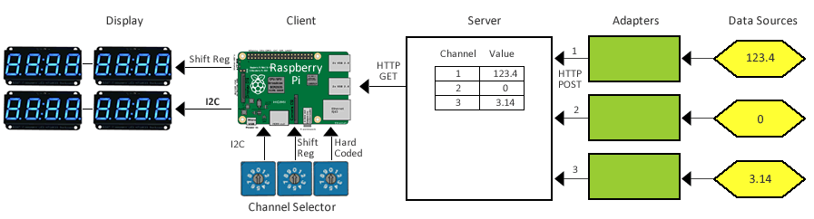

# metricsinyourface

A simple IoT project that pulls data from the cloud (the "server") and displays it on one or more seven-segment displays (the "client"). Seven-segment displays are a bit retro but very easy to read from a distance and more attention-getting than a tablet or small screen. Also, you can connect very large displays up to 10cm.

##Component Overview



The system is based on a cloud-based data buffer that is inspired by a [Tuple Space](https://en.wikipedia.org/wiki/Tuple_space) architetrue. The following components interact to make it work:

* _Data Sources_ expose metrics. This can be the number of FaceBook likes on your page, the number of commits in your GitHub project or yoru room temperature.
* _Adapters_: extract metrics, format / adapt them as needed and POST them to the server.
* The _Server_ acts as central data hub. Data is addressed via channels.
* _Clients_ (Raspberry Pi) periodically fetch data from the _Server_ and display it on seven-segment _Displays_. Multiple displays can be connected to one client.
* _Channel Selectors_ define which data channels a _Client_ should display.
 
## Operations

The Raspberry Pi requires Internet access, either via a Wifi adapter or Ethernet. When the Pi is able to read the data, the dot at the end of the display will blink slowly. If the Pi is unable to fetch data, the whole display will blank on and off. If the diplay neither blanks nro has a blinking dot, the Pi is likely hung.
 
## Hardware
To minimize the number of GPIO ports used and to allow multiple displays on a single client, input and output occurs serially. Two options are implemented, each of which corresponds to a dedicated source file, `readconfig_` for reading channel selectors and `sevenseg_` for data displays:
* Shift registers using '595 for output, '166 for input. Shift registers allow driving large LED displays that require more than 5 volts, but require more wiring.
* I2C bus using Adafruit LED backpacks based on HT16K33 for output, MCP23017 for input.

The _Channel Selectors_ input can also be hardcoded [readconfig_fake.py](client/readconfig_fake.py). The detailed protocols and assumptions are as follows:

* Serial input: Each display's configurable ID and number of digits is read from chained shift registers, 16 bits per display. Bits 0-11 are the display ID (aka "channel"), Bits 13-15 specify the number of digits (000 = 1, 110 = 7, 111 not allowed), Bit 12 is not used. Source: [readconfig.py](client/readconfig.py), Schematic: [readcfg.PNG](hardware/readcfg.PNG). 
* I2C input: The same bit assigment, but read from a 16 bit I2C port expander, which saves a lot of wiring. Multiple expanders can be connected (one for each display), addresses in ascending order of their I2C address (0x20 - 0x27). Source: [readconfig_i2c.py](client/readconfig_i2c.py)
* Serial Display: Large displays can be driven via chained shift registers, 8 bits per digit. The Pi shifts the correct number of digits for each display so that they can be chained together without addressing. Source: [sevenseg_shift.py](client/sevenseg_shift.py), Schematic; [7SEG_RAW.PNG](hardware/7SEG_RAW.PNG)
* I2C Display: To simplify soldering you can connect 4-digit I2C displays from Adafruit. The displays are addressed in ascending order of their I2C address (0x70 - 0x77). Source: [sevenseg_i2c.py](client/sevenseg_i2c.py)

## Client Code

The `client` folder contains the code running in the Pi. To execute: 

    sudo python display_metric.py url domain

The Pi retrieves values to be displayed from the server based on the display ID and the `domain` string. For example if `valueprefix` is `foo` and a display with the ID 3 is connected to the Pi, it will look for the value of the parameter `foo3`.

## Server-side code

The `server` folder contains the code running on a public cloud. It starts a simple Web server available via HTTP.

Execute : `npm install`, then `node app.js`. A deployment script more easily deploys on a Linux box. See the sub directory : deployment scripts. It has been tested on an EC2 instance AWS Linux AMI.

The server can easily run on AWS Beanstalk: create a zip from the file contained in the server folder after having done an 'npm install' and follow the instruction on AWS Beanstalk wizard.

#### API version 1
Set value with HTTP POST (if domain is missing, it is defaulted to *undefined*):

```
curl -v -H "Content-Type: application/json" -X POST -d  '{"domain": "testdomain", "id":"testid", "value":"200"}' http://myhost:3000/setValue
```

Get Value with HTTP GET or directly from browser (if domain is missing, it is defaulted to *undefined*): 
    
```
curl -v http://myhost:3000/getValue?id=testpi&domain=testdomain
```

#### API version 2
Set value with HTTP POST:

```
curl -v -H "Content-Type: application/json" -X POST -d  '{"value":"200"}' http://myhost:3000/:domain/:id
```

Get Value with HTTP GET or directly from browser: 

```
curl http://myhost:3000/api/:domain/:id
```

#### Client identifier
The server is using the header *remote_host* to identify the client.

#### System domain
The `system` domain provides administrative/monitoring/test functions.  The following ID's are currently supported:

* 1 returns the number of clients known
* 2 returns the number of clients that were active in the last 60 seconds 

Trying to GET access to an ID different from the known one returns an error code 404 (not found)

System domain with ID = 1 and 2 can only be queried, a POST on with prefix = 'system' returns 403 (forbidden) 


